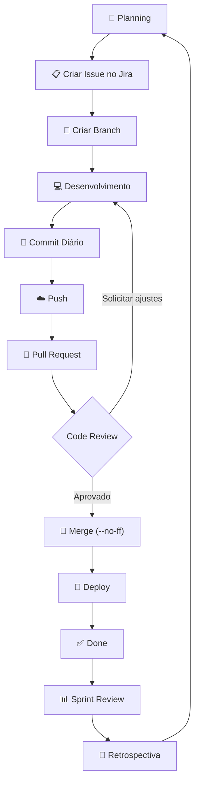

# imersao-profissional-projeto-de-software

 

 

 

# 📚 Escola de TI 2026 — Guia do Projeto

> **Objetivo deste documento**
>
> Este README reúne o regulamento da disciplina, os requisitos obrigatórios do projeto e as diretrizes internas adotadas pelo time para padronizar o desenvolvimento, minimizar Não-Conformidades (NCs) e facilitar a colaboração durante todo o semestre.

---

# 📑 Sumário

* [Objetivos](#-objetivos)
* [Times](#-times)
* [Projetos](#-projetos)
* [Requisitos Arquiteturais](#-requisitos-arquiteturais)
* [Artefatos Obrigatórios](#-artefatos-obrigatórios)
* [Processo de Desenvolvimento](#-processo-de-desenvolvimento)
* [Ferramentas](#-ferramentas)
* [Avaliações](#-avaliações)
* [Rebanca](#-rebanca)
* [Restrições sobre IA](#-restrições-sobre-ia)
* [Não Conformidades](#-não-conformidades)
* [Diretrizes Internas do Time](#-diretrizes-internas-do-time)
* [Boas Práticas do Git](#-guia-de-boas-práticas-do-git)
* [Checklist Diário](#-checklist-diário)
* [Checklist de Sprint](#-checklist-de-sprint)
* [Checklist Final](#-checklist-final)

---

# 🎯 Objetivos

## Objetivo Geral

Desenvolver um software de qualidade que resolva problemas relevantes dos usuários, concebido, projetado e implementado seguindo as boas práticas da Engenharia de Software.

## Objetivos Específicos

* Desenvolver trabalho colaborativo e respeitoso;
* Promover aprendizado contínuo;
* Garantir participação ativa de todos os integrantes;
* Produzir evidências objetivas da participação individual;
* Aplicar boas práticas de arquitetura, desenvolvimento e documentação.

---

# 👥 Times

Os times deverão obedecer às seguintes regras:

* Formação livre;
* Mínimo de **4 integrantes**;
* Máximo de **6 integrantes**;
* Não será permitida troca de integrantes após a formação.

---

# 💡 Projetos

Cada equipe poderá:

* propor um projeto próprio (sujeito à aprovação dos professores);
* escolher um projeto disponibilizado pelos parceiros da Escola de TI.

O projeto deve possuir escopo suficiente para manter toda a equipe ocupada durante o semestre.

---

# 🏗 Requisitos Arquiteturais

O projeto deverá conter obrigatoriamente:

* Backend REST Stateless;
* Controle transacional;
* Persistência relacional ou não relacional;
* Frontend Web (HTML5 + JavaScript);
* Aplicação Mobile;
* Testes automatizados

  * Unitários
  * Integração
* Arquitetura preparada para aproximadamente:

|   Escrita |   Leitura |
| --------: | --------: |
| 1.000.000 | 2.000.000 |

Também deverá possuir:

* Pelo menos um caso de uso utilizando WebSocket;
* Integração com API de Pagamentos (Mercado Pago, Stripe, Abacate Pay etc.);
* Deploy da aplicação.

É permitido utilizar tecnologias complementares.

Não é permitido utilizar frameworks ou geradores de código que escondam grande parte da implementação da aplicação.

---

# 📄 Artefatos Obrigatórios

Todos os artefatos devem ser mantidos atualizados durante o desenvolvimento.

Não serão aceitos documentos produzidos somente ao final do projeto.

## Documentação mínima

* Diagramas de Caso de Uso
* Diagramas de Classes
* Diagramas de Sequência
* DER
* Glossário
* System Design
* Casos de Uso completos
* Critérios de Aceitação
* Cenários de Teste
* Mockups
* Documentação da API REST

---

# 🔄 Processo de Desenvolvimento

A disciplina sugere um processo baseado em **Kanban**.

Fluxo esperado:

```
Backlog

↓

Planning

↓

Desenvolvimento

↓

Review

↓

Retrospectiva

↓

Refinamento do Backlog
```

A cada duas semanas deverá ocorrer:

* Sprint Review
* Sprint Retrospective

Todos os artefatos deverão ser publicados no Jira/Confluence.

---

# 🛠 Ferramentas

## Jira

Utilizado para:

* Backlog
* Issues
* Horas
* Planejamento

## Confluence

Utilizado para:

* Documentação
* Retrospectivas
* Reviews

## GitHub

Responsável pelo versionamento de:

* Código
* Documentação
* Diagramas

## Integração Contínua

Cada equipe deverá possuir sua estratégia de:

* CI
* Merge
* Release

Exemplo:

* Jenkins

---

# 📊 Avaliações

A nota base será composta pelas apresentações.

Após isso serão aplicados os seguintes ajustes.

## Avaliação 360°

* Não existe autoavaliação.
* O integrante com maior nota recebe 100%.
* Os demais recebem nota proporcional.

## Implementação CRUD

| Situação     | Desconto |
| ------------ | -------- |
| Completa     | 0%       |
| Parcial      | 15%      |
| Insuficiente | 25%      |

---

# 🤖 Restrições sobre IA

É proibido o uso abusivo de:

* Inteligência Artificial
* Agentes de programação
* Templates de terceiros

O objetivo da disciplina é avaliar o conhecimento técnico dos integrantes.

Caso a equipe não demonstre domínio do projeto poderá:

* ir para rebanca;
* ser reprovada.

---

# 📝 Rebanca

Caso qualquer integrante obtenha média inferior a **60 pontos**, toda a equipe será encaminhada para a rebanca.

A rebanca serve para comprovar o domínio técnico individual dos integrantes.

---

# ⚠️ Não Conformidades

## Normais

**Penalidade:** -0,5 a cada 3 ocorrências.

* Branch fora do padrão
* Commit sem descrição adequada
* Merge sem `--no-ff`
* Horas apontadas incorretamente
* Status da Issue desatualizado
* Entrega fora do prazo

---

## Graves

**Penalidade:** -0,5 por ocorrência.

* Falta nas reuniões
* Trabalhar sem branch
* Não realizar commits diariamente
* Não realizar atividade acordada
* Não anexar artefatos
* Criar Issues fora do Planning
* Não responder avaliação 360°

---

## Gravíssima

**Penalidade:** -1,0 por ocorrência.

* Burlar deliberadamente o regulamento.

---

## Imperdoável

**Penalidade**

Perda da nota do grupo.

Ocorrência:

* Não comparecer à apresentação bimestral.

---

# 📌 Observações

* NC apontada incorretamente pelo auditor é considerada Grave.
* NC não apontada pelo auditor também é considerada Grave.

---

# 📌 Diretrizes Internas do Time

> **Importante**
>
> As práticas desta seção **não fazem parte do regulamento oficial da Escola de TI**. Elas foram definidas pelo time para padronizar o desenvolvimento, facilitar auditorias e reduzir o risco de Não-Conformidades.

---
## 🚀 Fluxo de Desenvolvimento



# 🚀 Guia de Boas Práticas do Git

## 🌿 Branches

Toda branch deverá:

* ser criada a partir da branch de desenvolvimento;
* estar vinculada a uma Issue;
* seguir o padrão:

```
#1332 - efetuando implementações iniciais
```

---

## 💾 Commits

Os commits devem:

* ser claros;
* descrever exatamente a alteração realizada;
* facilitar auditorias.

Evite:

```
fix
update
teste
```

Prefira:

```
Implementa autenticação JWT

Adiciona endpoint de cadastro

Refatora serviço de pagamento

Corrige validação de CPF
```

---

## 📅 Frequência

Durante o desenvolvimento:

* commit diário;
* push diário;
* nunca trabalhar sem branch.

---

# 🔀 Fluxo de Merge

Utilizar obrigatoriamente:

```bash
git checkout desenvolvimento

git merge --no-ff minha-branch
```

Isso preserva o histórico das funcionalidades.

---

# 🌳 Fluxo Git

```
main

│

├──────── desenvolvimento

│              │

│              ├──── feature/#123

│              │

│              ├──── feature/#456

│              │

│              └──── feature/#789

│

└──────── release
```

---

# 📅 Checklist Diário

| Item                       | ✔ |
| -------------------------- | - |
| Horas apontadas            | ☐ |
| Status da Issue atualizado | ☐ |
| Commit realizado           | ☐ |
| Push realizado             | ☐ |
| Branch correta             | ☐ |

---

# 📋 Checklist da Sprint

| Item                     | ✔ |
| ------------------------ | - |
| Review realizada         | ☐ |
| Retrospectiva realizada  | ☐ |
| Avaliação 360 respondida | ☐ |
| Documentação atualizada  | ☐ |
| Artefatos anexados       | ☐ |

---

# 📦 Checklist da Release

| Item                          | ✔ |
| ----------------------------- | - |
| Testes executados             | ☐ |
| Deploy realizado              | ☐ |
| API documentada               | ☐ |
| Merge realizado com `--no-ff` | ☐ |
| Branch removida               | ☐ |

---

# ✔️ Checklist Final do Projeto

## Processo

* [ ] Backlog atualizado
* [ ] Issues planejadas
* [ ] Horas apontadas diariamente
* [ ] Status atualizado
* [ ] Review realizada
* [ ] Retrospectiva realizada

## Código

* [ ] Backend REST
* [ ] Frontend Web
* [ ] Mobile
* [ ] WebSocket
* [ ] API de Pagamento
* [ ] Testes Unitários
* [ ] Testes de Integração

## Arquitetura

* [ ] System Design
* [ ] Diagrama de Classes
* [ ] Casos de Uso
* [ ] DER
* [ ] Glossário
* [ ] Mockups
* [ ] API REST

## Avaliação

* [ ] CRUD completo
* [ ] Avaliação 360 respondida
* [ ] Todos os integrantes preparados para a apresentação
* [ ] Todos dominam tecnicamente o projeto

---

# 📚 Referências

* Regulamento da Escola de TI 2026
* Boas Práticas de Engenharia de Software
* Git Flow
* Kanban
* Scrum
* Clean Code
* Conventional Commits (recomendado)

----
Template o que, quem, quando e como (entregas)
-> ainda tem que criar
----
[ex]
Sprint 1
☐ Modelagem
☐ Casos de Uso
☐ Backend Base

Sprint 2
☐ CRUDs
☐ Frontend
☐ Mobile

Sprint 3
☐ WebSocket
☐ Pagamentos
☐ Testes

Sprint 4
☐ Deploy
☐ Documentação
☐ Apresentação
